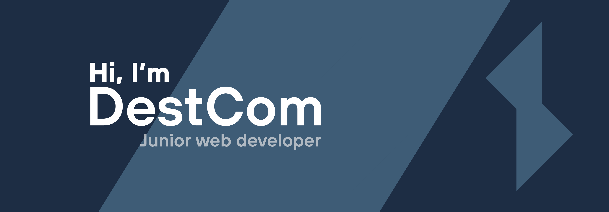

Hi 👋 , I’m @DestroyCom or DestCom, as you want !

I'm currently working as an intern at TF1 Le groupe, the leading French and European TV channel, on the website [MYTF1](https://www.tf1.fr) in the Front-End team.

Check my [Portfolio](https://portfolio.stroyco.eu) ! :fire:

---

## :coffee: Get to know me

- :fr: I’m French :baguette_bread::croissant:

- :eyes: I'm really curious and I love to learn new things, this is one of the advantages of being a developer, everything evolves continuously, there is no routine, and I love that !

- :tada: I use the "Stroy" branding for the most of my projects

- :sparkles: My current dream job would be to work at Ubisoft

- :telescope: I’m currently working on [MYTF1](https://www.tf1.fr) as an intern at TF1 Le groupe

- :computer: I study at [HETIC](https://www.hetic.net/) in Montreuil, France

- :heart: I have a big passion for cinema :movie_camera:, photography :camera:, and obviously video games :space_invader:

- :musical_note: I can't pass a day without music
  

---

## :zap: My skills / My stack

| Languages                                                                                                                                                                                                                                                                                                                                                                                                                                                                                                                                                                                                                                                                                                                                                                                                                                                                                                                                                                                                                                         | Frameworks                                                                                                                                                                                                                                                                                                                                                                                                                                                                                                                                                                                                                                                                                                                                                          | Tools                                                                                                                                                                                                                                                                                                                                |
| ------------------------------------------------------------------------------------------------------------------------------------------------------------------------------------------------------------------------------------------------------------------------------------------------------------------------------------------------------------------------------------------------------------------------------------------------------------------------------------------------------------------------------------------------------------------------------------------------------------------------------------------------------------------------------------------------------------------------------------------------------------------------------------------------------------------------------------------------------------------------------------------------------------------------------------------------------------------------------------------------------------------------------------------------- | ------------------------------------------------------------------------------------------------------------------------------------------------------------------------------------------------------------------------------------------------------------------------------------------------------------------------------------------------------------------------------------------------------------------------------------------------------------------------------------------------------------------------------------------------------------------------------------------------------------------------------------------------------------------------------------------------------------------------------------------------------------------- | ------------------------------------------------------------------------------------------------------------------------------------------------------------------------------------------------------------------------------------------------------------------------------------------------------------------------------------ |
|           |       |    |

**_And more..._**, I didn't have the space to put everything and i'm always learning new things :fire:

---

## :books: My favorites projects

Here is a list of different projects I have done or participated in that are part of my favorites

- [StroyBot (OpenSource project)](https://github.com/DestroyCom/StroyBot) : A twitch bot to manage draws/contest, currently used by [Xiaomi France](https://www.twitch.tv/xiaomifrance) with +25k followers

- [StroyCord (OpenSource project)](https://github.com/DestroyCom/StroyCord) : It's a Discord bot to link voice-chats and youtube :eyes:

- [StroyGetter (OpenSource project)](https://github.com/DestroyCom/StroyGetter) : A PWA made with react to download things from youtube _(please don't sue me)_

- [Weatherplay](https://github.com/DestCom-Technical-Test/weatherplay) & [Wither](https://github.com/DestCom-Student-Projects/Wither-Forecast) : Two simple weather forecast webapps, I like them because you can see the evolution of my code and design style in a little less than a year

---

## :clipboard: My GitHub resume

                                                                                                                                                                

---

## 📫 Want to contact me ?

You can use my contact form on my portfolio, i'll reply you back 
[https://portfolio.stroyco.eu](https://portfolio.stroyco.eu)
